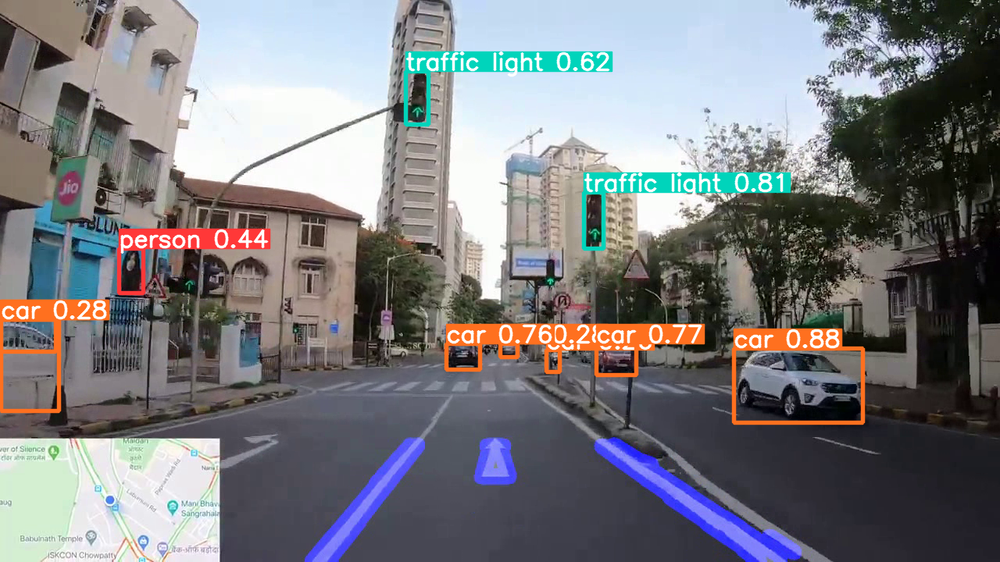
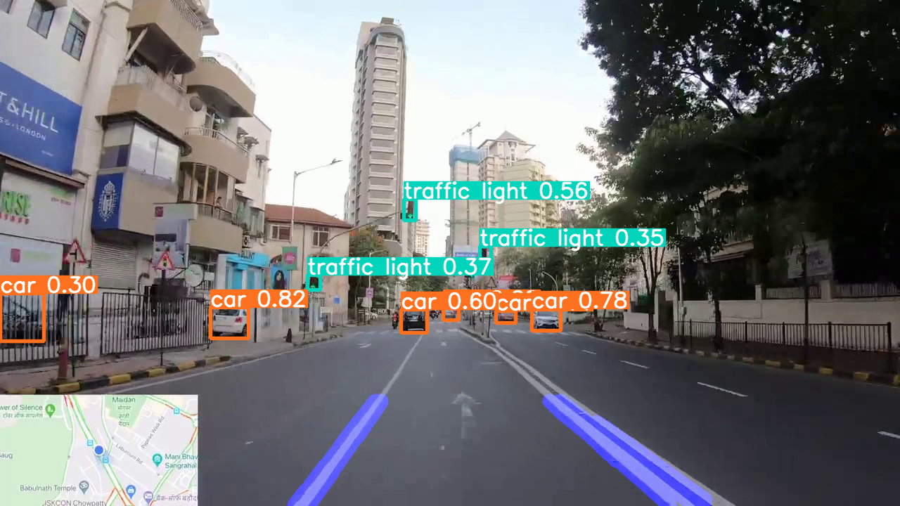
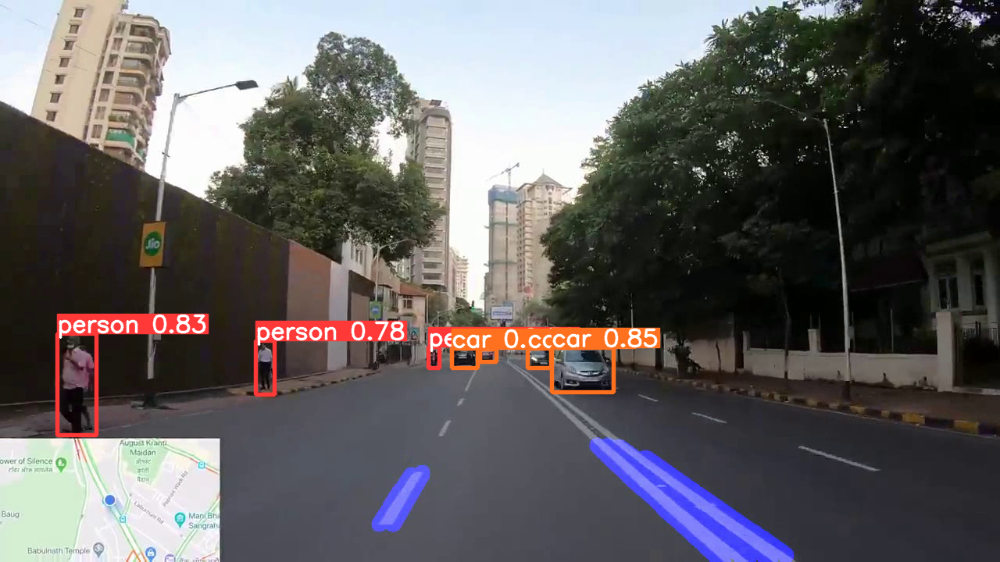

## Lane Detection and Object Detection
This project is designed to improve road safety by detecting road lanes and identifying objects in real-time. The system utilizes computer vision techniques to process video feeds, where lane detection ensures vehicles stay within lanes, and object detection helps identify obstacles like vehicles, pedestrians, and traffic signs. YOLOv5, a state-of-the-art deep learning model, enhances the accuracy of object detection, while tools like Matplotlib and Seaborn assist in visualizing the data and results effectively.

## 📦 Requirements

* Python version 3 or above (with pip, matplotlib, numpy, seaborn)
* PyTorch
* OpenCV Library for python package
* Recommended CUDA with CUDNN (For Nvidia GPU Processing)
* Yolo Version 5 Repository with yolov5s.pt model (required files are included in this repository itself) 

## 🚦 Running the Project

To run the project in your local environment, follow these steps:

1. Clone this repository
2. Get a New Terminal from the current location.
3. Type `python3 lane.py` & `python3 yolov5/detect.py --source ./lines.avi --view-img`
4. You can include any video as your wish by modifying the `lane.py` file. (here video.m4v is the selected video)

## 📷 Screenshots

  
Click to view screenshots

  
  
  

## 📄 Reference
https://github.com/ultralytics/yolov5
